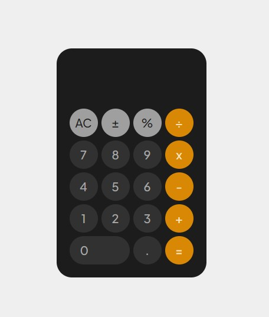

# 💻 Calculator

- Uma calculadora simples, baseada no layout do IOS.

    

## 🧪 Tectnologias
- HTML 5
- CSS 3
- JavaScript

## 🚀 Como executar
- Basta fazer o download dos arquivos e abrir o `index.html` no seu navegador.